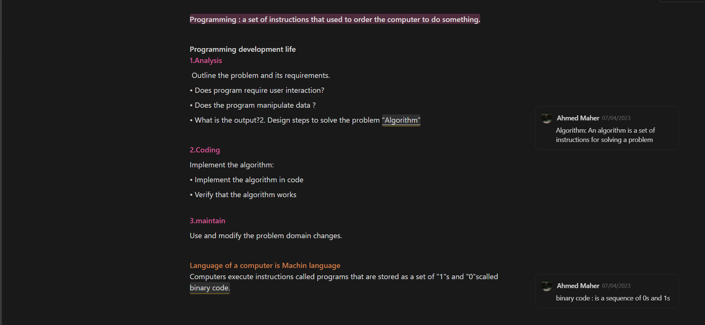
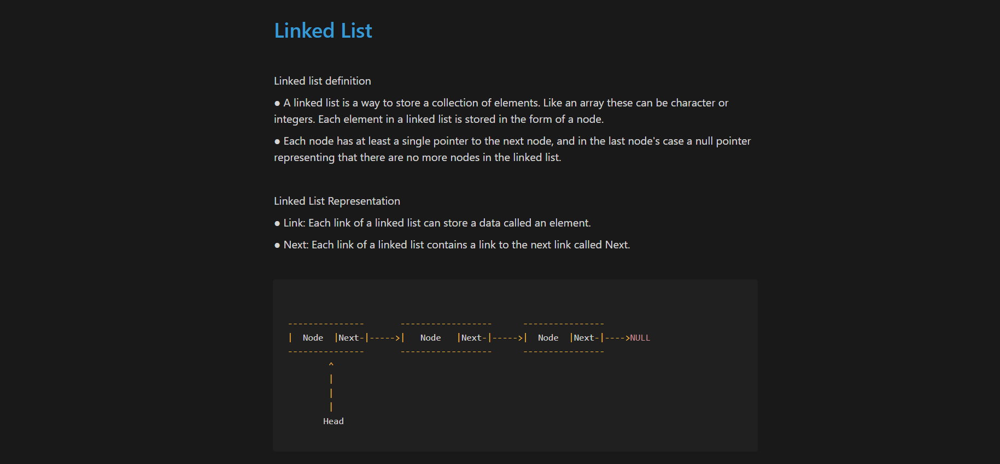
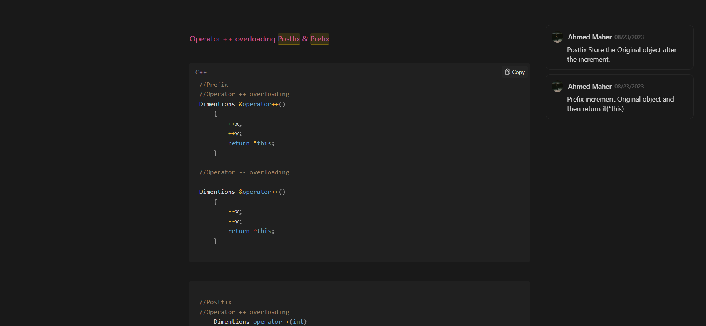
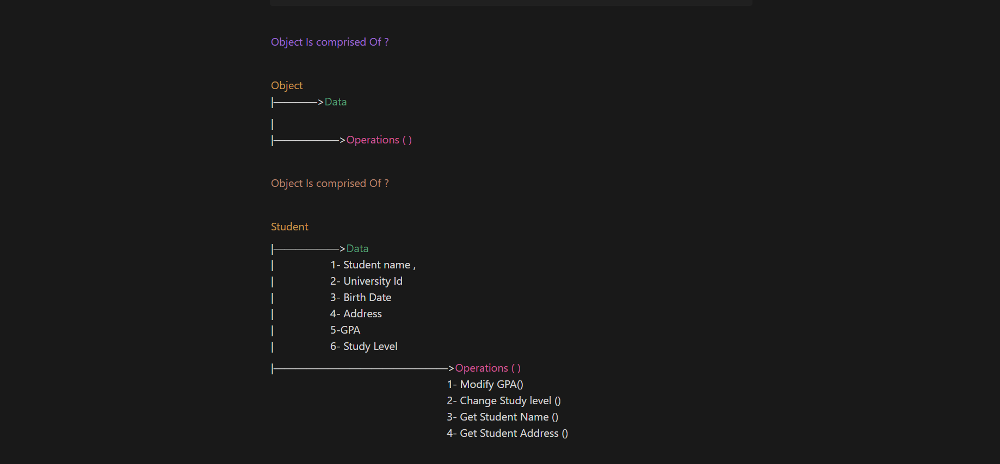

# 🚀 C++ Learning Hub  
*Master the Fundamentals of C++, OOP, and Data Structures*  

  

This repository organizes essential C++ learning resources from **MEC Academy's Software Development Fundamentals** program.  
All content is hosted on Notion for interactive, up-to-date access.


## 📚 Core Topics  
Click on each module to explore detailed notes with code examples:  

| Topic | Description | Notion Link |
|-------|-------------|-------------|
| **C++ Basics** | Syntax, Loops, Functions, Pointers | [](https://www.notion.so/Basics-C-3e955c08bfa64ce0987f2b5987e3806d?pvs=21) |
| **OOP** | Classes, Inheritance, Polymorphism | [](https://www.notion.so/OOP-5bac92ec023746b6a769a39d58aad77c?pvs=21) |
| **DSA** | Arrays, Linked Lists, Algorithms | [](https://www.notion.so/Data-Structure-Algorithms-7290c9ef31a044c6af8f2661ebaaf316?pvs=21) |


### 🌐 To access the full content of all sections

📦 **A comprehensive file that includes all lessons, links, and summaries:**

[](https://battle-farmhouse-146.notion.site/Software-Development-Fundamentals-MEC-Academy-237293a199ba80348e32eff2d3e25ad2)

> 👆 *Click on the link to fully explore the Software Development Fundamentals course on Notion.*


---

## 🖥️ Sample Code Preview  
### C++ Basics: Pointer Example  
```cpp
int main() {
    int x = 10;
    int* ptr = &x;
    cout << "Value: " << *ptr; // Output: 10
    return 0;
}
```


---

## 🔍 What You'll Find in Each Notion Guide  
| Module | Key Features |  
|--------|--------------|  
| **C++ Basics** | ✔ Interactive code playgrounds <br> ✔ Memory diagrams <br> ✔ Common pitfalls |  
| **OOP** | ✔ diagram examples <br> ✔ Real-world analogies <br> ✔ SOLID principles |  
| **DSA** | ✔ Time complexity charts <br> ✔ Step-by-step animations <br> |  

---


## 🌟 Why Use These Resources?  
- **Always Updated**: Changes sync automatically in Notion  
- **Multi-Format**: Embed videos, quizzes, and PDFs in one place  
- **Progress Tracking**: Checkboxes for completed topics  


---

## 🛠 How to Contribute  
1. Fork this repository  
2. Suggest improvements via Issues  
3. Request edit access to Notion pages  

📧 **Contact**: [ahmedbnmaher1@gmail.com]  

--- 

## Visual Guide from the Notion Course 







**For the best experience**:  
[](https://www.notion.so/Software-Development-Fundamentals-MEC-Academy-237293a199ba80348e32eff2d3e25ad2)  

--- 